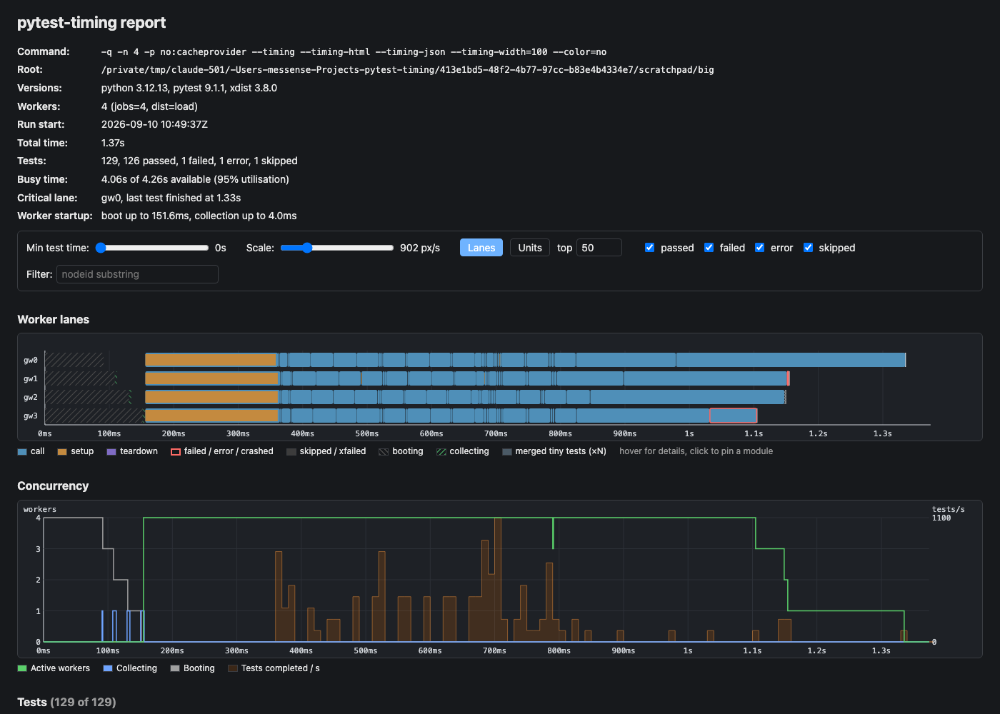

# pytest-timing

See where your test time goes. pytest-timing records when every test ran, on which
[pytest-xdist](https://github.com/pytest-dev/pytest-xdist) worker, and for how long,
then shows the run as a timing report in the spirit of `cargo build --timings`: an
ASCII Gantt chart in the terminal and a self-contained HTML report. It can also use
the previous run's timings to balance the next run's xdist worker queues.

```
pytest -n 4 --timing --timing-html
```

```
================================ timing report =================================
pytest-timing: 129 tests (1 error, 1 failed), 4 workers, wall 1.37s, busy 95.4%
worker |-----------|-----------|------------|-----------|-----------|--------  busy%
gw0    ░░░░░░   ▄███████████████▄███████████████████████████████████████████    93.6%
gw1    ░░░░░░░  ▄██████████████████████████████████████████████████X            94.1%
gw2    ░░░░░░░░▒▄███████████████████████████████████████████████████▄           96.2%
gw3    ░░░░░░░░░▄████████████████████████████████▄███████████XXXXX             98.2%
       0s          0.20s       0.40s        0.60s       0.80s       1.00s 1.37s
       legend: ░ boot  ▒ collect  █ tests  ▄ <50% busy  X failure

slowest 3 tests (setup ░ / call █ / teardown ▒):
gw0                                                    ████████████████████▒    0.36s
       test_big.py::test_slow[5]
gw2                                               ████████████████▒            0.30s
       test_big.py::test_slow[4]
gw1               ░░░░░░░░░░░░░▒                                               0.21s
       test_big.py::test_many[8]
HTML report written to pytest-timing.html
```

Works with and without `-n`. Without xdist the run is a single `main` lane.

Each lane shows worker start-up, collection, tests and failures; `▄` marks a column
that is under half busy, so idle gaps stand out. The slowest tests are drawn on the
same axis with their setup / call / teardown split. A shared fixture's set-up shows
up in the setup phase of the first test that needed it on each worker, which is how
pytest itself reports it.

The HTML report has the same data with a zoomable lane chart, a concurrency graph,
filters, hover details and a sortable table:



## Install

```
pip install pytest-timing            # plugin only
pip install "pytest-timing[xdist]"   # with pytest-xdist
```

Python 3.10+ and pytest 7.3+. Distributed runs need pytest-xdist 3.7+.
CPU and memory records include live subprocesses on Linux through `/proc`, on macOS
through `libproc`, and on Windows through [psutil](https://pypi.org/project/psutil/)
when installed. Without psutil, Windows CPU records cover only the worker itself and
memory records only the worker; other POSIX platforms count children the worker has
waited for. Each record identifies its measurement coverage.

## Options

| Option | Effect |
|---|---|
| `--timing` | Record timings and print the ASCII chart in the terminal summary. |
| `--timing-capture=full\|light` | Full metrics (default), or timings without CPU/memory measurement. Implies timing. |
| `--timing-html` | Write a self-contained HTML report to `pytest-timing.html`. |
| `--timing-json` | Write the recorded run to `pytest-timing.json`. |
| `--timing-trace` | Write a Chrome trace file for [Perfetto](https://ui.perfetto.dev) to `pytest-timing.trace.json`. |
| `--timing-html-file PATH`, `--timing-json-file PATH`, `--timing-trace-file PATH` | Same, to an explicit path. |
| `--timing-schedule PATH` | Under xdist, plan the workers' queues from the JSON run at `PATH`. |
| `--timing-cpus N\|auto` | Under xdist, admit tests against a budget of `N` CPU slots per host (`auto` detects it). |
| `--timing-memory SIZE\|auto` | Under xdist, keep tests whose recorded memory would not fit in `SIZE` together from running at once (`auto` takes 80% of the host's memory). |
| `--timing-top=N` | Rows in the slowest-tests section (default 10, `0` hides it). |
| `--timing-min=SECONDS` | Hide tests shorter than this from the slowest-tests section. |
| `--timing-ascii-style=unicode\|ascii` | Chart glyphs. |
| `--timing-width=N` | Override the terminal width for the chart. |

Any output, schedule or CPU-budget option implies `--timing`. The output flags are
plain booleans and the `-file` options always take a path, so
`pytest --timing-json test_x.py` runs exactly `test_x.py`. Formatting options and CPU
annotations alone do not enable timing collection or scheduling. Relative report
and schedule paths are resolved from pytest's root directory.

The ini key `timing` is a boolean; `timing_html`, `timing_json` and `timing_trace`
accept paths or `true` for the default filenames. Other ini keys are
`timing_capture`, `timing_schedule`, `timing_cpus`, `timing_memory`, `timing_top`, `timing_min` and
`timing_ascii_style`.
Environment variables use the uppercase key prefixed by `PYTEST_`, for example
`PYTEST_TIMING=1`, `PYTEST_TIMING_HTML=path` or `PYTEST_TIMING_CPUS=auto`.
`--timing-width` is command-line only.

For output paths, scheduling and formatting, the command line wins over the
environment, which wins over ini. Timing is enabled if any source requests it:
`PYTEST_TIMING=0` does not disable `timing=true` in ini or an enabled output.

Use `--timing-capture=light` (or `PYTEST_TIMING_CAPTURE=light`, or
`timing_capture = light` in ini) for timing-only collection. It keeps phase and
shared-fixture durations, worker lifecycle and admission waits, but does not create
a process-tree CPU reader or memory sampler. CPU work/rate, pressure and resident
memory measurements are unavailable; wait-only records have unknown measurement
coverage, rather than a measured zero. Declared CPU admission and memory admission
from an existing full report still apply. Capture stays `full` unless explicitly
changed; use full capture when refreshing resource estimates for future scheduling.
Capture mode names are case-insensitive in CLI, environment and ini settings.

## Outputs

**JSON** is the plugin's own record of the run: tests with their worker, phases and
shared fixtures, plus CPU telemetry when available (elapsed time, measured CPU time,
statically declared demand and time waiting for CPU slots) and the resident memory
of the worker's process tree around each test, in bytes: `base` before its set-up,
`peak` during it, and `after` at its teardown. The difference between `peak` and
`base` is what the test needed on top of the worker's existing footprint; `after`
minus `base` is what stayed, such as a shared fixture it set up. With
`--timing-memory`, the run's `memory` describes the budget and how admission went,
and a test the memory gate held back carries the seconds it waited in `memory.wait`,
as `cpu.wait` does for the CPU gate; the HTML report's table and hover details and
the terminal's slowest-tests rows show them.
It also records worker
lifecycles, detected host CPU environments, and how the session ended (`finished`,
`collect_only`, `interrupted`, `aborted`, `internal_error`, with pytest's reason). It is
the input to the CLI below and to `--timing-schedule`.

**HTML** is a single file with no external dependencies, so it can be attached to a CI
job as an artifact and opened anywhere. Where CPU and memory were measured it shows
them: each test's CPU time, the CPUs it kept busy on average (beside the slots it
declared) and the memory it needed on top of its worker's footprint, in the table and
the hover details; the run's totals and budgets in the header; and CPU and memory
usage over time. The two graphs are drawn from the per-test records, not sampled: a
test's CPU time is spread evenly over its run, and a worker counts at its running
test's peak, so they show where the load was rather than its exact shape.
Each curve uses at most 4096 display samples, even at deep zoom. A sample keeps
the maximum over its time bucket; hover reports that bucket's time range. This
bounds display memory without dropping short peaks. Merged tiny-test bars cache
their total duration and ten longest tests for repeated hover.

**Trace** is a Chrome Trace Event file. Open it in
[Perfetto UI](https://ui.perfetto.dev) with "Open trace file", or in `chrome://tracing`.
Each worker is a track, every test is a bar, and the setup / call / teardown phases
nest underneath it. In Perfetto, W/S zoom and A/D pan; drag to select a time range.
See the [Perfetto UI guide](https://perfetto.dev/docs/visualization/perfetto-ui).

## Schedule the next run from the last one

```
pytest -n 4 --timing-json --timing-schedule pytest-timing.json
```

xdist's default scheduler hands tests out in collection order, which can leave long
tests until late or distribute expensive fixture set-ups unevenly. With
`--timing-schedule`, the previous run's JSON drives a plan that accounts for test
duration, shared fixture costs and declared CPU demand. Tests with the same fixture
dependencies are kept together unless splitting them improves the predicted finish
enough to justify duplicated set-ups. Fixture-bound and CPU-heavy work takes
priority, with longer tests first within those groups. Work moves between workers
as the run drifts from the plan.

The command above reads the file from the previous session and rewrites it at the end,
so one cached file is all CI needs to carry between jobs:

```yaml
- uses: actions/cache@v4
  with:
    path: pytest-timing.json
    key: pytest-timing-${{ github.run_id }}
    restore-keys: pytest-timing-
- run: pytest -n 4 --timing-json --timing-schedule pytest-timing.json
```

What to expect:

- A missing or unreadable history file falls back to xdist's scheduler unless
  `--timing-cpus` is also set. With an explicit CPU budget, admission stays active
  using equal duration estimates. The summary explains the fallback; when history
  loads, it also reports known test durations and shared fixtures.
- Tests not in the file (new or renamed) are estimated at the mean of the known ones.
  Re-record often: a new test that turns out to be huge can start late.
- History merged from several shards with `pytest-timing merge` is supported too.
- The gain depends on the suite and the accuracy of its history. Long tests and
  expensive shared fixtures offer opportunities to improve balance; measure on
  your suite, since estimates and scheduling overhead can also make a run slower.

Two xdist distribution modes are scheduled this way, chosen with xdist's own `--dist`:

- `--dist load` (the default with `-n`): the controller feeds each worker a few tests
  at a time and keeps the rest of the plan, where it can still move.
- `--dist worksteal`: each worker normally gets its whole plan in one command, and a
  worker that runs dry takes a chunk back from another one. CPU admission splits
  dispatch into segments where demand rises, so heavier tests wait for slots.

Other modes such as `loadscope` or `each` keep xdist's scheduler. Neither duration
planning nor CPU admission applies in those modes, and the summary notes it.

## Schedule around CPU-hungry tests

Some tests are not one process on one CPU: a test that builds with `make -j4`, runs a
parallel solver or starts a small cluster keeps several CPUs busy, and eight such tests
on eight workers can oversubscribe the machine. Declare what each test needs so the
controller can reserve slots before it starts:

```python
import subprocess

import pytest
import pytest_timing


@pytest.mark.timing_cpu(4)  # four slots, subprocesses included
def test_parallel_build():
    subprocess.run(["make", "-j4"], check=True)


@pytest_timing.cpu(4)  # the set-up needs four, tests reusing it one
@pytest.fixture(scope="session")
def compiled_model():
    return build_model(jobs=4)


@pytest_timing.cpu(2, hold=1)  # and one slot for as long as it is alive
@pytest.fixture(scope="session")
def background_server():
    with serve() as server:
        yield server
```

Here `build_model` and `serve` stand for your project's fixture helpers.

```
pytest -n 8 --timing-cpus auto
```

Every unmarked test weighs one slot. A marker on a class or a module `pytestmark`
sets the default for its tests, and the closest marker wins: function over class over
module. Weights reserve scheduling capacity; they do not cap a process's CPU usage.
The JSON's measured CPU work and coverage help you check the declarations.

`--timing-cpus N` sets the budget per host. `auto` uses the CPU count, capped by the
process's affinity mask and cgroup CPU quota where available, rounded down to at
least one slot. It enforces that budget even below the worker count: with a quota of
two CPUs, `-n 4 --timing-cpus auto` admits two one-slot tests at a time.

With a successfully loaded `--timing-schedule` history, declarations above one slot
or fixtures holding slots also enable admission, including declarations on fixtures
requested dynamically. In this case the detected budget is raised to at least the
number of workers. Heavy tests and held slots can still delay one-slot tests.
Annotations with only `--timing` or an output option do not enable admission.

What to expect:

- A worker whose next test does not fit waits with its fixtures alive. The oldest
  request has priority, so small tests cannot repeatedly take its needed slots.
  Small work can use spare slots or backfill when it is predicted to finish before
  the oldest request could start.
- Slots a fixture holds stay reserved until it is finalized, including through
  tests that do not use it but remain in its scope. A test that cannot fit next to
  what other workers hold waits on the controller, and when nothing else can move,
  an idle worker keeping such a fixture is shut down so its slots come back.
- A dependency reached only through `getfixturevalue` is absent from the static
  fixture closure. If it was not recorded in history, the planner cannot include it
  in the test's reservation. Before a declared fixture's set-up, the worker asks
  the controller for any additional slots and waits for them.
- Demand above the current admission limit is clamped to that limit and reported
  in the summary. If fixture holds leave every worker unable to proceed, the
  scheduler releases holds by shutting down an idle worker where possible, then
  forces the oldest blocked request if needed. Such forced reservations can exceed
  the limit and are counted in the summary.
- The summary reports the budget, the number of tests over one slot, and how long
  tests waited for slots in total. Each test's JSON record carries its own wait in
  `cpu.wait`. `cpu.runtime_wait` records admission waits inside a running test. These waits
  are excluded from duration estimates, fixture setup costs and measured CPU rate.
  A runtime request that gets no grant within five minutes cancels the fixture
  setup. It waits to recover the test's original reservation before failing, so
  cleanup and any retry still run with CPU slots reserved.
- On the controller's Linux host, sustained quota throttling or CPU pressure with
  low measured throughput lowers the admission limit one slot at a time. It is
  restored slowly after the pressure clears. Existing reservations are unchanged;
  the lower limit delays new admissions. Remote hosts and hosts without these
  signals keep their configured limit.
- A budget smaller than what the machine can really do costs time: gating serialises
  work that could have run at once. Declare heavy tests and let `auto` size the
  budget, or set it to what the job may use.

The gate applies in `load` and `worksteal` mode. Workers started with `popen`, the
default, share a local budget; workers on other hosts (`--tx ssh=...`) form separate
domains with their own budgets. With `-x` or `--maxfail`, xdist shuts every worker
down; a test a worker was holding without having been admitted is withdrawn and
never starts.

## Keep memory-hungry tests apart

Two tests that each need several gigabytes are fine on their own and fatal together:
the kernel kills a worker, or the whole job. Nothing needs declaring for this. Every
run records how much resident memory each test needed on top of its worker's footprint
(`memory` in the JSON), and the next run keeps tests apart when their recorded needs
would not fit in the budget at the same time:

```
pytest -n 4 --timing-json --timing-schedule pytest-timing.json --timing-memory 12G
```

`--timing-memory` takes a size with a binary suffix (`512M`, `12G`) or `auto`, which
takes 80% of physical memory, capped by the cgroup memory limit. It reads the memory
each test needed from the run at `--timing-schedule`, so the first run only records;
the summary says how many tests had recorded memory. A test with no record weighs
nothing until it has run once. A module- or class-scoped fixture keeps what its first
test left resident (a loaded model, say) reserved for as long as it is alive, on that
worker. What session- and package-scoped fixtures keep is treated as part of every
worker's footprint instead: each worker sets them up once and never lets go, so
gating on them could only delay the run, never spare the host.

What to expect:

- The gate is the same fair waiting line as for CPU: a worker whose next test does
  not fit waits with its fixtures alive, and the oldest request goes first. Memory
  and CPU budgets are checked together; a test starts only when both fit.
- Estimates are the largest need any recorded attempt showed. For an attempt that
  set up shared fixtures, what stayed resident afterwards is the fixtures' (or the
  worker's footprint), and the test's own need is what it used beyond that. The
  first test on each worker also pays for the worker's warm-up, so its record is
  used only for a test or fixture with no other attempt. Estimates are relative to
  the worker's footprint, so `auto` leaves a fifth of the host for the workers
  themselves, their session fixtures, the controller and everything else; set a
  smaller budget on a shared machine, and a larger share of headroom when session
  fixtures are big.
- A test recorded above the budget runs alone, and the summary counts it. Allocator
  behaviour can make an estimate low: a test that reuses heap an earlier test freed
  shows a smaller rise than it needs. Large buffers and subprocesses, the usual
  cause of an out-of-memory kill, measure well.
- Memory does not enter the planner: lanes are still balanced by duration and fixture
  cost, and the gate only delays starts. Under `--dist load` and `worksteal`, like
  CPU admission.
- The summary says how many tests waited for memory and for how long, and how long
  workers sat parked at the gate without running what they waited for. Each held
  test's JSON record carries its wait in `memory.wait`.

## Re-render or merge saved runs

```
pytest-timing render pytest-timing.json --html report.html --ascii
pytest-timing merge shard1.json shard2.json -o all.json
```

`render` produces any of the outputs from a saved JSON run. `merge` places several runs
(for example CI shards) on one shared time axis using their absolute start times.

## Compare runs and enforce CI budgets

```
pytest-timing compare before.json after.json
pytest-timing compare before.json after.json --budget duration=10% --budget memory=64MiB --json comparison.json
```

Comparisons match tests by node ID and show total, setup, call and teardown time,
CPU time, and peak memory rise above the worker's baseline. For each run, only the
final retry of each worker/occurrence is used, then repeated observations are
combined with a median. The output includes retry counts and added/removed tests.
Missing measurements stay unavailable, including partial coverage across repeats.

A budget sets the maximum increase **per common test**. Percentages are relative
to the baseline; a zero baseline permits no increase under a percentage budget.
Time limits use seconds or `ms`; memory limits use bytes, `KiB`, `MiB` or `GiB`.
Each metric accepts one budget. Added and removed tests are listed but not budgeted.
Exit codes are `0` for success (or a comparison without budgets), `1` for exceeded
budgets, and `2` for invalid input or unavailable checks. Budget checks need complete
runs, at least one common test, successful final attempts and every requested metric.
Differences in Python, pytest, worker count or distribution mode produce warnings;
use comparable environments and repeat noisy workloads before choosing thresholds.

## Explore the HTML report

The scale control zooms all timelines together. Scrolling any timeline moves the
others to the same time. Curves are resampled from the visible window, so a narrow
peak gains detail as you zoom in, with at most 4,096 samples per curve. Hover values
are the maximum within the displayed bucket.

Enter start and end times in seconds and select **Select range** to fit that interval
across lanes, concurrency, admission waits, CPU and memory. The test and fixture
tables follow the selection and existing filters. **Clear range** returns to the
whole run. The range summary covers all tests, independently of text/outcome/fixture
filters; CPU totals integrate the original estimated curve, never its peak buckets.
CPU time is spread evenly over each test span, while the memory curve places the
recorded peak over that span; neither is a sampled execution trace.

The shared fixture table groups recorded setup costs by fixture key and worker,
showing repetition across tests and workers. Select a fixture to see its associated
tests and use **Clear fixture filter** to restore them. Costs belong to overlapping
tests: fixture setup timestamps are not recorded, so costs cannot be clipped to a
selected interval. A `None` fixture value means reuse and contributes no setup.

New reports include controller-observed `admission_waits` intervals on the exact
test attempt that waited. Lane strips and the wait graph display those intervals;
one interval refused by both CPU and memory counts once in the graph, summary and
Held column (its hover still lists both gates).
Older JSON files remain readable, but their wait totals cannot be placed on a
timeline. Workers parked without ever running a test remain in the run-level gate
summary rather than being assigned to an unrelated test.

## Overhead

Timing collection also measures fixtures and CPU work in each worker. Its overhead
depends on the platform, live process tree, suite and enabled outputs. From a source
checkout, compare disabled, timing, JSON and CPU admission on 3,000 trivial tests:

```
uv run python benchmarks/cpu_bench.py --workers 4 --cpus 4 \
  --scenario tiny --repeat 5 --out timing-overhead.json
```

To compare admission on parallel workloads and an expensive session fixture:

```
uv run python benchmarks/cpu_bench.py --workers 4 --cpus 4 \
  --scenario parallel --scenario fixture --repeat 3 --out timing-scheduler.json
```

Choose worker and CPU counts for your machine. The benchmark keeps the fastest run
per configuration; its printed wall time includes pytest process startup and report
writing. Rows with a timing report also include pytest session time and available
CPU measurements; other rows use process wall time for the session field.

## How it works

See [ARCHITECTURE.md](ARCHITECTURE.md) for how timings are captured, how shared
fixtures are timed inside the workers, how the scheduler plans and rebalances, and how
CPU admission works.

## License

MIT
